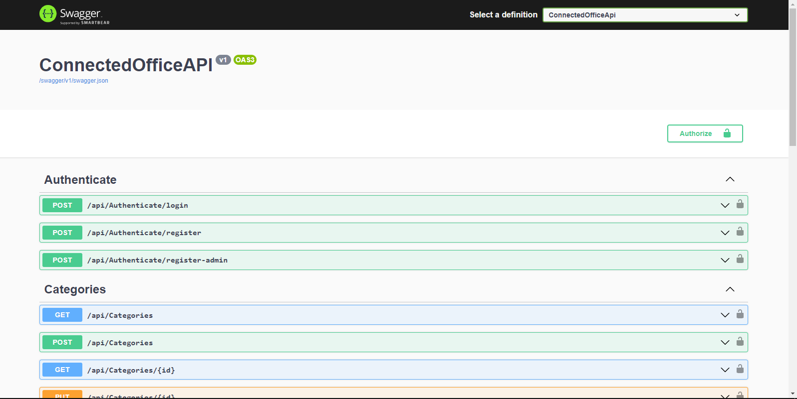
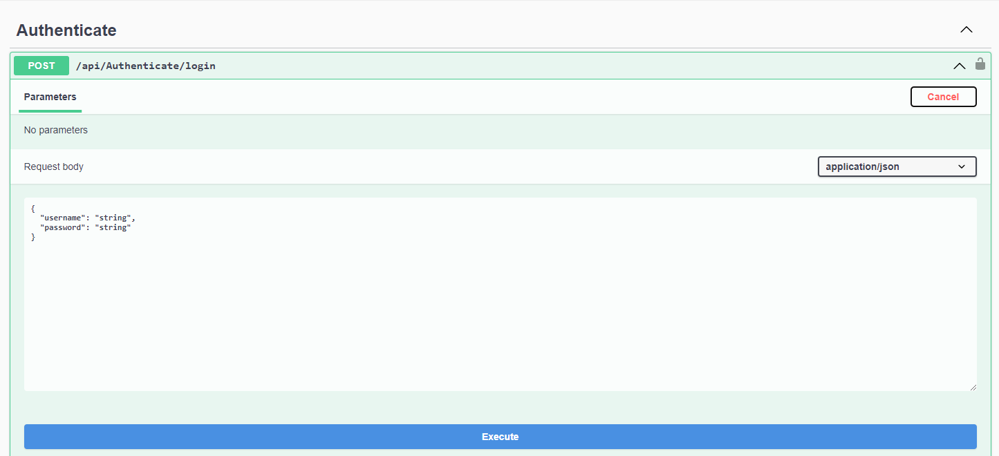
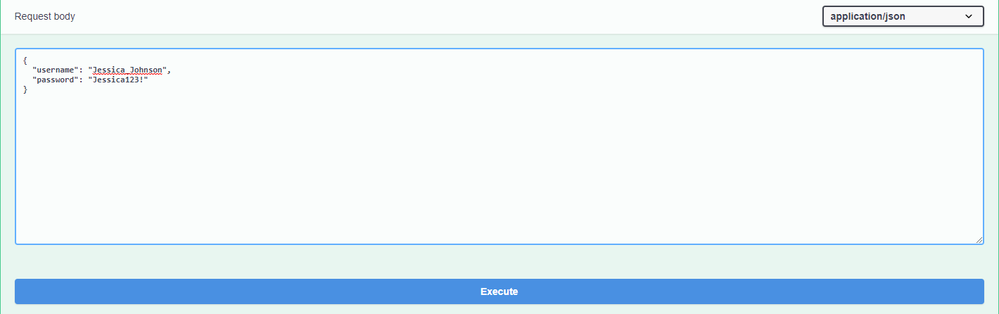
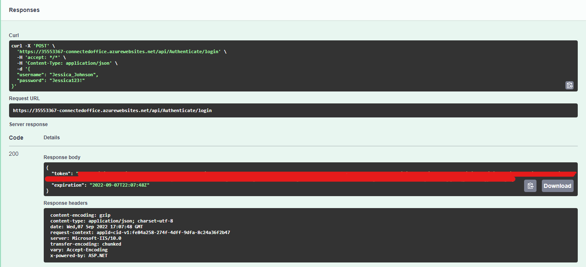
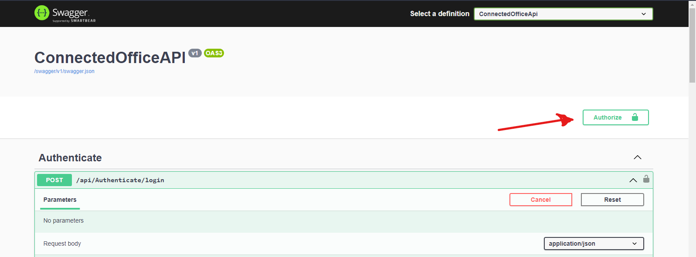
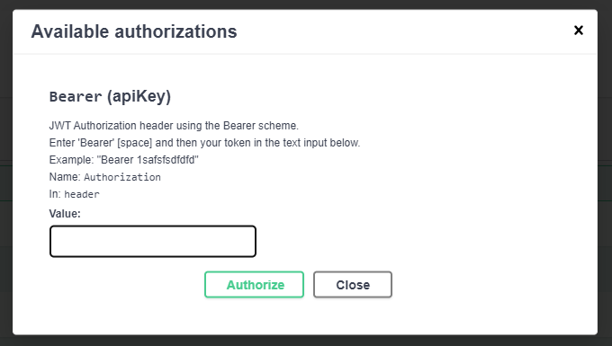
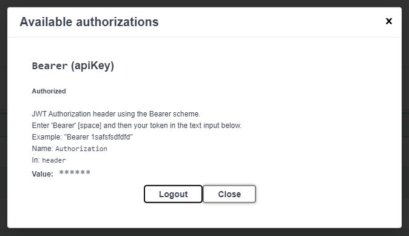
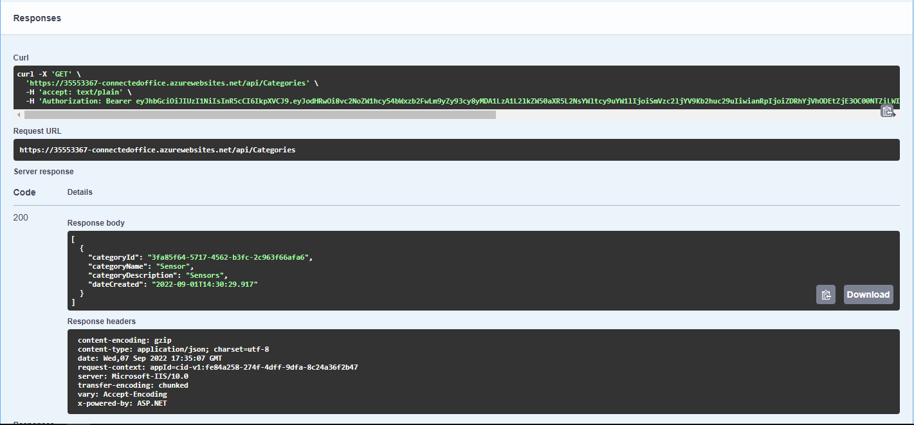

# CMPG-323-Project-2-35553367

Second project for CMPG-323 Module

# Project Description

This is a smart device management API which is used to track the location of all IoT (Internet of things enabled devices) used by an organization, with this API administrators will be able to locate and change the properties of any IoT device used within their organization, this API will be created using:

- ASP .Net Core
- Azure
- REST framework
- Entity framework
- Identity framework

# How to use

## Azure Hosted API

1. Navigate to the [API website](https://35553367-connectedoffice.azurewebsites.net/swagger/index.html) you should see page similar to:

 

this is a frontend generated by swagger and will allow you to test all the end points in a user friendly way

2.  now you need to login, the API endpoints are all secured and need authentication to use in order to login click the "/api/Authenticate/login" dropdown and click the "try it out" button if done correctly you should see

 
 
this step is crucial since no other endpoints can be tested without authentication

3. In the text area below the "Request body" section insert the username and password of the user, by default there are 2 users for testing you may login as one of them

```json
{
  "username": "Jessica_Johnson",
  "password": "Jessica123!"
}
```

Jessica is a regular user and does not have access to Updating and Deleting routes

```json
{
  "username": "JohnathanFisher",
  "password": "Johnathan123!"
}
```

Johnathan is an admin user and has full access

In order to login in copy and paste the details of one of the users into the text area as follows



And click the execute button

4. After clicking the execute button you should be logged in and you will recieve a JWT token which you need to add to the header of each subsequent request



Copy this token value to the clipboard

5. The next step is to authorize this will ensure that swagger will add the authentication headers to each request automatically. To do this navigate to the top of the page and click on the "Authorize" button



This will open up a pop up.

6. After clicking the button you should see a pop up like this



in the text box type Bearer followed by a [space] followed by your JWT token (Recieved in step 4) and click "Authorize"

This should open another pop up which looks like this



Now click close, the authentication process is completed.

You may now make use of any of the endpoints by clicking on the endpoint name and selecting try it out



Please be aware that by default the JWT token will expire in **3 hours**, should your session exceed 3 hours you will be required to login again, repeat steps 2 to 7

Also note that reloading the page will also reset the authentication and you will have to login again

# References used during devlopment

cephalin. 2022. Quickstart: Deploy an ASP.NET web app - Azure App Service. MSDN. https://docs.microsoft.com/en-us/azure/app-service/quickstart-dotnetcore Date of access: 07 Sep. 2022.

Kanjilal, J. 2022. How to implement JWT authentication in ASP.NET Core 6. InfoWorld. https://www.infoworld.com/article/3669188/how-to-implement-jwt-authentication-in-aspnet-core-6.html Date of access: 31 Aug. 2022.

Sandrino Di Mattia. 2020. JWT Bearer Authentication and Authorization for ASP.NET Core 5. sadrino.dev. https://sandrino.dev/blog/aspnet-core-5-jwt-authorization Date of access: 07 Sep. 2022.

Vincenzo Chianese. 2019. Security in your OpenAPI Specification | HackerNoon. Hackernoon. https://hackernoon.com/security-in-your-openapi-specification-94d081603950 Date of access: 07 Sep. 2022.

Other than these resources I would also like to mention a special thanks to all my friends in CMPG 323 who really helped me out extensively through the project, and the lecturers for the guidance documents (How the fuck do I reference that?)
